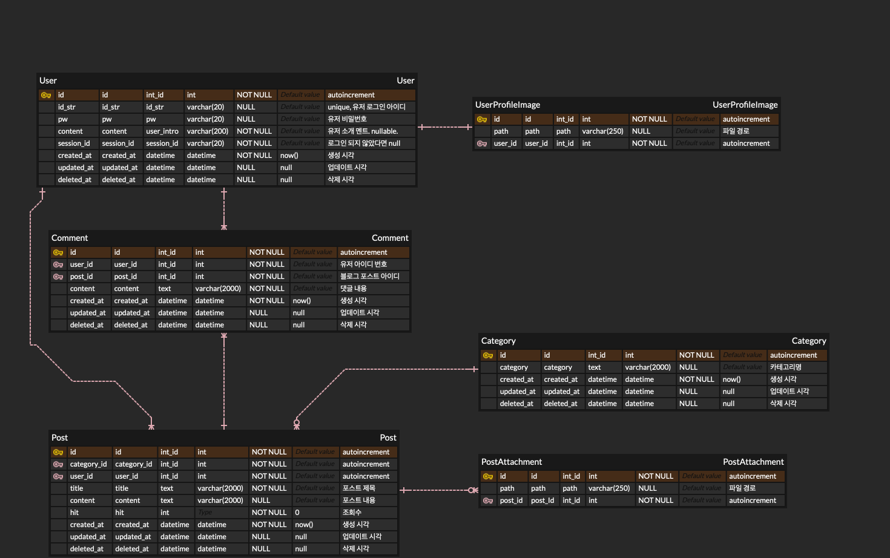
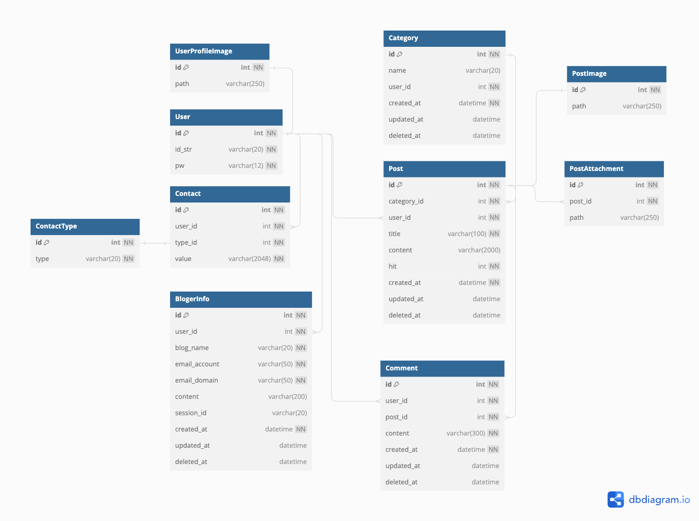
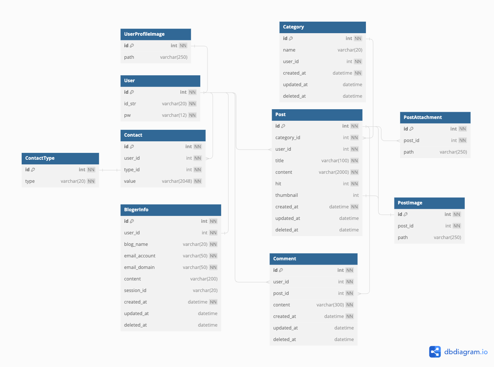

# ERD 설명 및 변경 사항

##ERD 231204

##ERD 231217

- 사용자를 두 종류로 나눌 수 있음.
    1. 글을 작성하는 블로그주인
    2. 댓글을 작성하는 블로그 방문자
    - 1번 사용자들만 다양한 개인정보를 저장할 필요가 있으므로 BlogerInfo라는 정보 저장 테이블을 생성하여 데이터 공간 효율을 노림

##ERD 231230

- 게시글에는 여러 이미지가 첨부될 수 있으므로 post 하나 당 여러개의 이미지를 삽입하기 위해 post_id를 외래키로 두어 개별 이미지들이 아이디를 갖도록 변경
- 아이디 한명 당 블로그도 한 개만 만들 수 있는 서비스이므로 User와 BlogerInfo 
일대일 대응으로 테이블 생성

