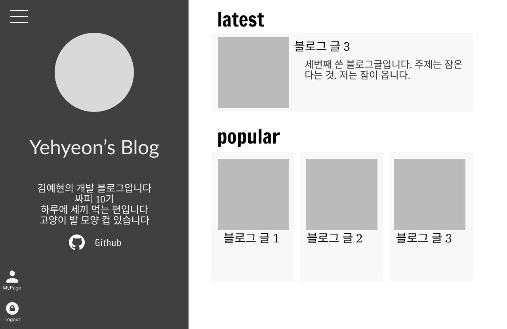
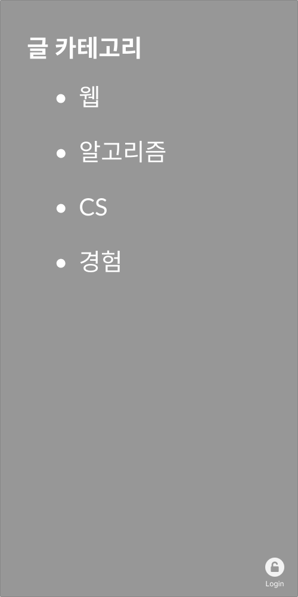
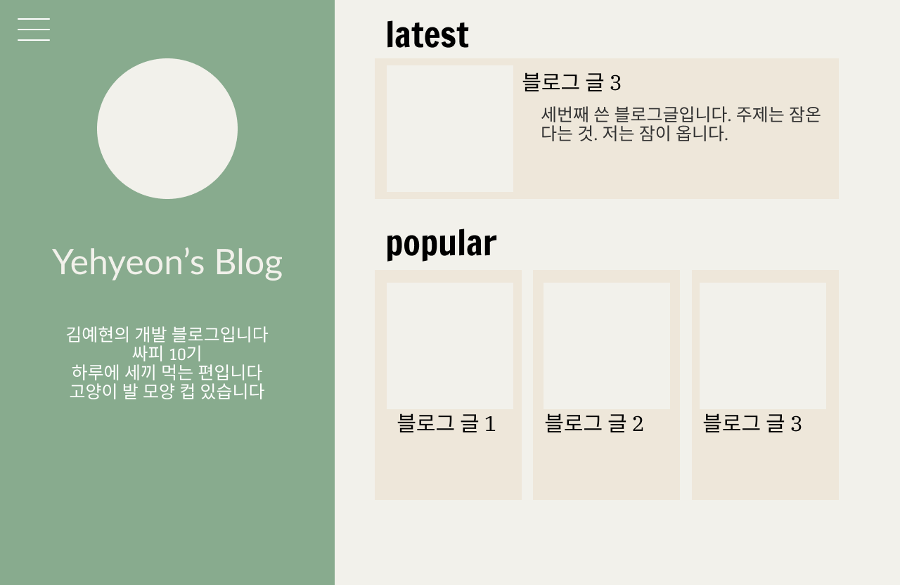
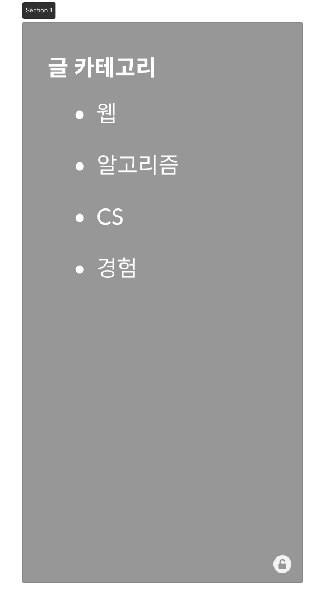
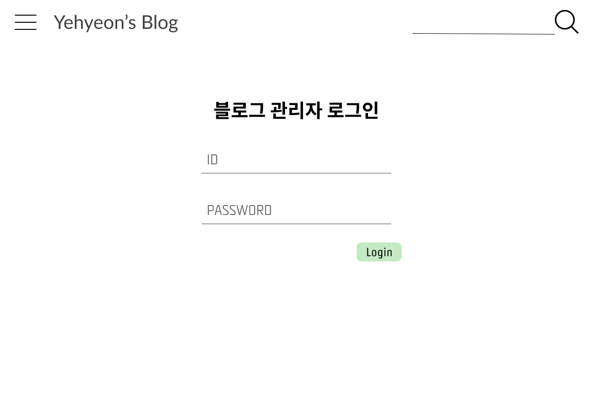
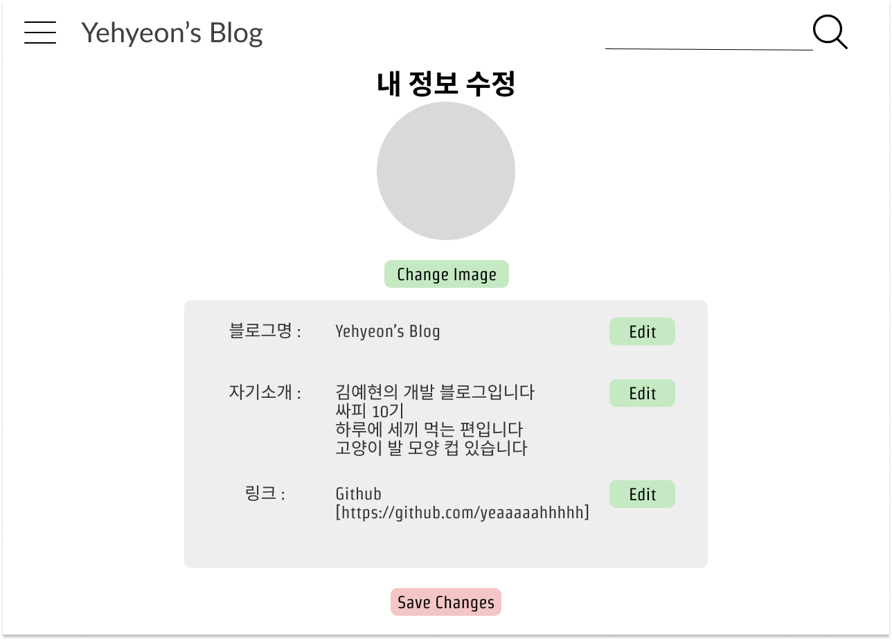
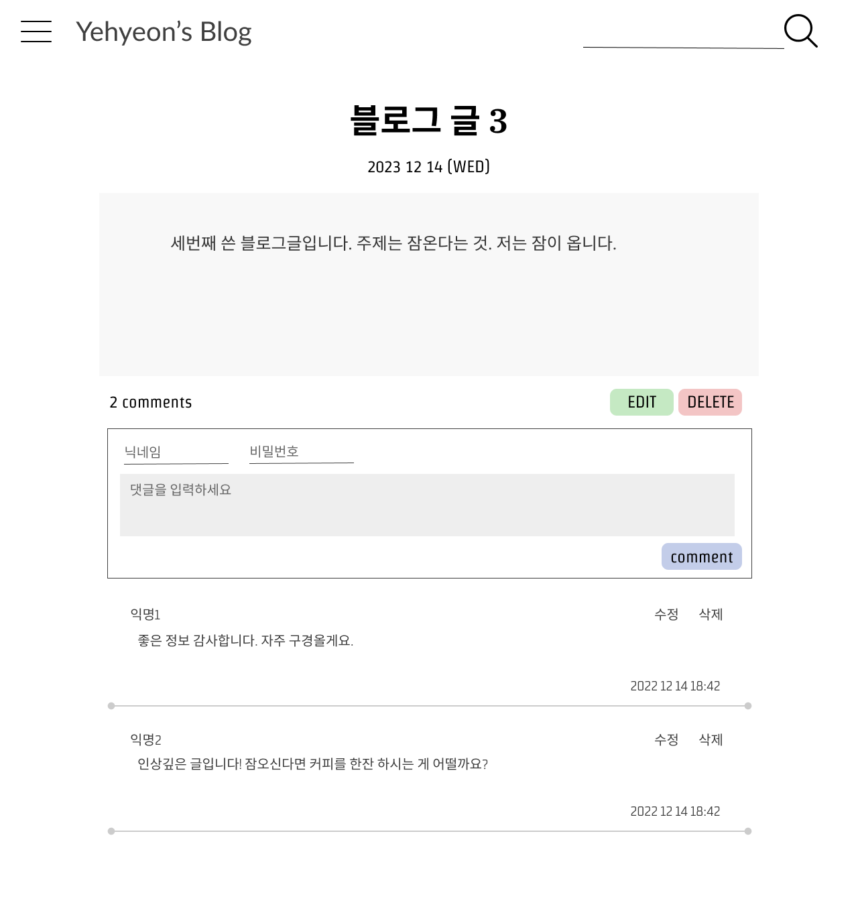

# 화면 설계서

- [Figma 링크](https://www.figma.com/file/40BOfU2MGDPIcboAFlfKi5/myBlog?type=design&node-id=84%3A55&mode=design&t=6dSJUDnVtWCnDNRX-1)

## 메인 페이지

### 240101

- login, logout, mypage 버튼을 이해하기 쉽도록 텍스트 추가

### 231215

- 로그인한 상태일 경우, 왼쪽 하단에 로그아웃 기능과 내정보 수정 버튼을 볼 수 있다
  
- 흑백 테마를 기본으로 더 잘 어울리는 색상 테마가 있을 경우, 테마 선택 기능을 추후에 추가할 수 있다
  
- 글 카테고리를 보여주는 drawer 배치
- 로그인 하지 않은 상태일 때, drawer 속 오른쪽 아래 로그인(unlock 버튼)으로 언제든지 로그인 페이지 접근 가능

## 회원 관련

### 로그인 페이지

### 내 정보 수정 페이지

## 게시판 관련

### 글 상세 보기 페이지

